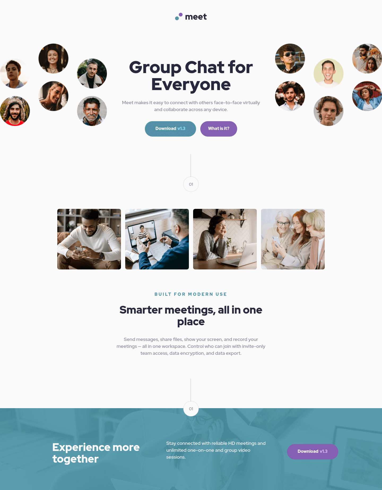

# Frontend Mentor - Meet landing page solution

This is a solution to the [Meet landing page challenge on Frontend Mentor](https://www.frontendmentor.io/challenges/meet-landing-page-rbTDS6OUR). Frontend Mentor challenges help you improve your coding skills by building realistic projects.

## Table of contents

- [Frontend Mentor - Meet landing page solution](#frontend-mentor---meet-landing-page-solution)
  - [Table of contents](#table-of-contents)
  - [Overview](#overview)
    - [The challenge](#the-challenge)
    - [Screenshot](#screenshot)
      - [Screenshot mobile](#screenshot-mobile)
      - [Screenshot tablet](#screenshot-tablet)
      - [Screenshot desktop](#screenshot-desktop)
    - [Links](#links)
  - [My process](#my-process)
    - [Built with](#built-with)
    - [What I learned](#what-i-learned)
    - [Continued development](#continued-development)
    - [Useful resources](#useful-resources)
  - [Author](#author)

## Overview

### The challenge

Users should be able to:

- View the optimal layout depending on their device's screen size
- See hover states for interactive elements

### Screenshot

#### Screenshot mobile


#### Screenshot tablet


#### Screenshot desktop



### Links

- Solution URL: [GitHub repository](https://github.com/jhoanSebasPerez/meet-landing-page-solution)
- Live Site URL: [Site deployed in GitHub Pages](https://jhoansebasperez.github.io/meet-landing-page-solution/)

## My process

### Built with

- Semantic HTML5 markup
- CSS custom properties
- Flexbox
- CSS Grid
- Mobile-first workflow

### What I learned

- Dynamic image loading depending on the viewport, this was used in the Hero part, where I made use of <picture> as a wrapper tag, and inside this the unary tag <source> with its responsive attribute "media" where it allows to set a condition for the respective image loading, the attribute "srcset" contains the path of the resource location. The  tag contains the image that will be loaded by default if the above conditions are not met.

  ```html
  <picture>
    <source
      srcset="./assets/desktop/image-hero-left.png"
      media="(min-width: 1024px)"
    />
    
  </picture>
  ```

- Use of the Grid Layout for the distribution of the internal components of the Hero, providing greater convenience when relocating the elements based on the Viewport of each device.

  ```css
  .hero {
    overflow-x: hidden;
    display: grid;
    grid-template-areas:
      "left"
      "content";
  }
  ```

when the viewport is 1024px or higher

```css
.hero {
  grid-template-areas: "left content right";
}
```

In each Hero component they are placed using the "grid-area" property.

### Continued development

I would like in future projects to implement pre-processors such as Sass, also to make use of animations to improve usability.

### Useful resources

- [A Complete Guide to Grid](https://css-tricks.com/snippets/css/complete-guide-grid/) - This resource helped me to remember certain properties for CSS Grid management, it is very useful because it provides visual content.

- [A Complete Guide to Flexbox
  ](https://css-tricks.com/snippets/css/a-guide-to-flexbox/) - Useful for remembering CSS Flex handling properties and their visual representation

- [<picture>: The Picture element](https://developer.mozilla.org/en-US/docs/Web/HTML/Element/picture) - Use and usefulness of the <picture> tag for semantics and management to dynamically load resources (responsive).

## Author

- linkedin - [Jhoan Sebastián Pérez Acosta](https://www.your-site.com)
- Frontend Mentor - [@jhoanSebasPerez](https://www.frontendmentor.io/profile/jhoanSebasPerez)
- Twitter - [@JhoanPerezA0](https://twitter.com/JhoanPerezA0)
